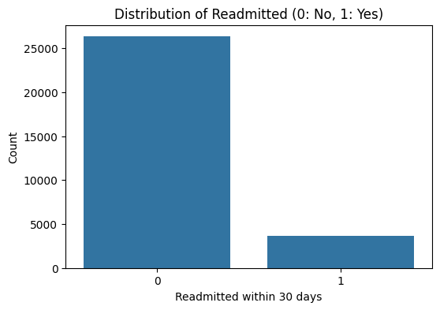
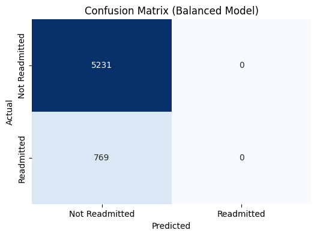

# AI-Re-Admission-Prediction

## Overview
This project is part of the PLP Week 5 assignment for the course "AI for Software Engineering." The goal is to apply the AI Development Workflow to a real-world healthcare scenario: predicting patient readmission risk within 30 days of discharge using machine learning. The project emphasizes ethical considerations, model deployment, and performance evaluation.

## Assignment Breakdown
The assignment is structured as follows:

- **Part 1: Short Answer Questions**
  - Problem definition, objectives, stakeholders, KPIs
  - Data sources, bias, preprocessing
  - Model selection, data splitting, hyperparameters
  - Evaluation metrics, concept drift, deployment challenges

- **Part 2: Case Study Application**
  - Problem scope, data strategy, ethical concerns
  - Preprocessing pipeline, feature engineering
  - Model development, confusion matrix, precision/recall
  - Deployment steps, compliance, optimization

- **Part 3: Critical Thinking**
  - Ethics, bias, mitigation strategies
  - Trade-offs between interpretability and accuracy
  - Impact of computational resources on model choice

- **Part 4: Reflection & Workflow Diagram**
  - Reflection on workflow challenges and improvements
  - AI Development Workflow diagram

## Project Structure

```
AI-ReAdmission-Prediction/
│
├── data/                # (Not included in repo) Raw and processed data
├── notebooks/           # Jupyter notebooks for EDA, modeling, etc.
│   └── Readmission_Prediction_Model.ipynb
├── src/                 # (Optional) Source code for utility functions
├── reports/             # (Optional) Generated analysis, PDF report
├── diagrams/            # (Optional) Workflow diagrams, flowcharts
├── README.md            # Project overview and instructions
└── .gitignore           # Ignore data, outputs, etc.
```

## Main Notebook
- **notebooks/Readmission_Prediction_Model.ipynb**
  - Contains all code for data loading, preprocessing, model training, evaluation, and discussion of results.
  - Well-commented and organized according to the AI workflow.

## How to Run
1. Clone the repository.
2. (Optional) Place your dataset in the `data/` directory.
3. Open `notebooks/Readmission_Prediction_Model.ipynb` in Jupyter Notebook or JupyterLab.
4. Run the cells sequentially to reproduce the analysis and results.

## References
- [Kaggle Hospital Readmission Dataset](https://www.kaggle.com/datasets/siddharth0935/hospital-readmission-predictionsynthetic-dataset)
- PLP Academy course materials
- scikit-learn, pandas, numpy, matplotlib, seaborn

## Notes
- All code is well-commented for clarity.
- The project follows the CRISP-DM and AI Development Workflow frameworks.
- For full assignment details, see the assignment PDF/report in the `reports/` directory (if available).

## Visualizations

Below are key visualizations generated during the analysis:

### Distribution of Readmitted Patients


### Confusion Matrix

